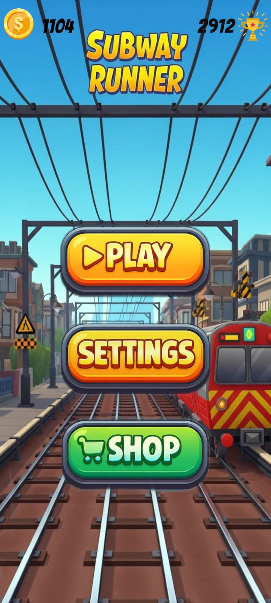
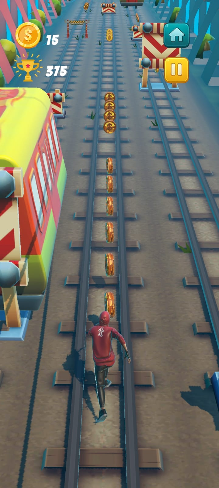
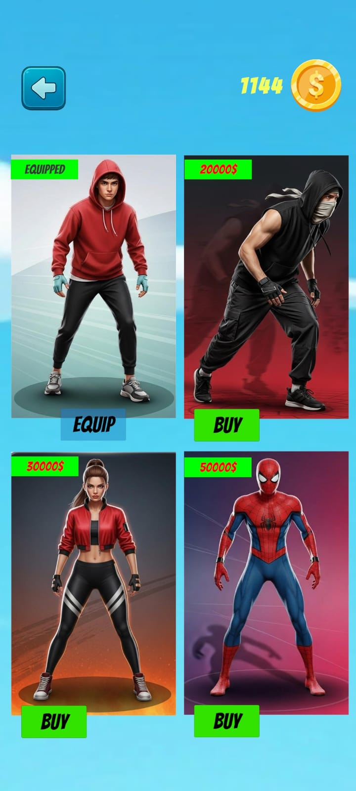
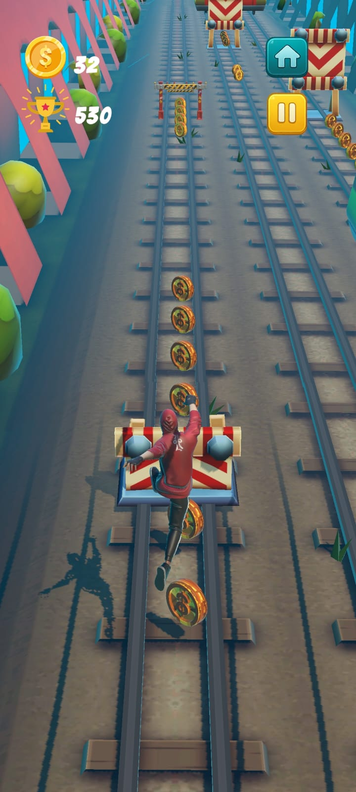
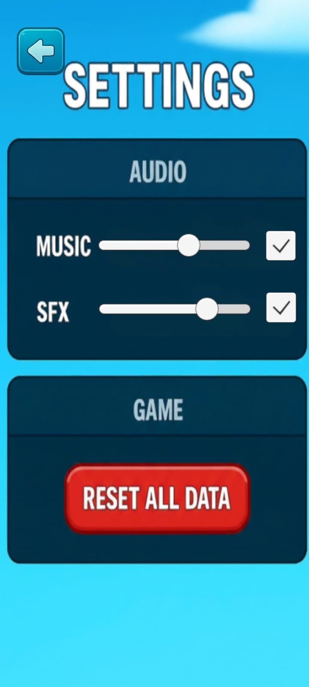

<h1> Hey! Nice to see you.</h1>

Welcome to my page!   I'm <b>Hamza</b>, a 3D Game Developer from  <b>Casablanca, Moroco</b>, currently building worlds with C# and Unity. 

<h3>Things I build games with</h3>

  
  
  
  
  
  
  
  
  
  
  
  

  
  

<h3>Open source projects</h3>
<table>
  <thead align="center">
    <tr border: none;>
      <td><b>🎮 Projects</b></td>
      <td><b>⭐ Stars</b></td>
      <td><b>📚 Forks</b></td>
      <td><b>🛎 Issues</b></td>
      <td><b>📬 Pull requests</b></td>
    </tr>
  </thead>
  <tbody>
    <tr>
      <td><a href="#"><b>Unity 3D RPG Controller</b></a></td>
      <td></td>
      <td></td>
      <td></td>
      <td></td>
    </tr>
    <tr>
      <td><a href="#"><b>Procedural Terrain Generator</b></a></td>
      <td></td>
      <td></td>
      <td></td>
      <td></td>
    </tr>
    <tr>
      <td><a href="#"><b>C# Inventory System</b></a></td>
      <td></td>
      <td></td>
      <td></td>
      <td></td>
    </tr>
  </tbody>
</table>

<h3>My latest posts</h3>
<ul>
  <li><a href="#"><b> Optimizing Draw Calls in Unity 2023</b></a> <i>How to keep your framerates high using batching and occlusion culling.</i></li>
  <li><a href="#"><b> Introduction to Entity Component System (DOTS)</b></a> <i>Writing high-performance multithreaded code in C#.</i></li>
    <li><a href="#"><b> Writing Custom Shaders with HLSL</b></a> <i>Moving beyond Shader Graph for total control over your visuals.</i></li>
  <li><a href="#"><b>SOLID Principles in Game Development</b></a> <i>How to write clean C# architecture that doesn't turn into spaghetti code.</i></li>
  <li><a href="#"><b>Physics Based Character Controllers</b></a> <i>Moving away from rigidbodies for tighter gameplay feel.</i></li>
</ul>

<h3>Take a look at my latest project: Subway Runner! 🏃</h3>

     
   
  
  
  
    

 

------------

This <i>README</i> file is generated <b>every 3 hours</b>! Last refresh: Monday, 3 March, 07:01 CET <a href="#">Create your own here!</a>

   
  

